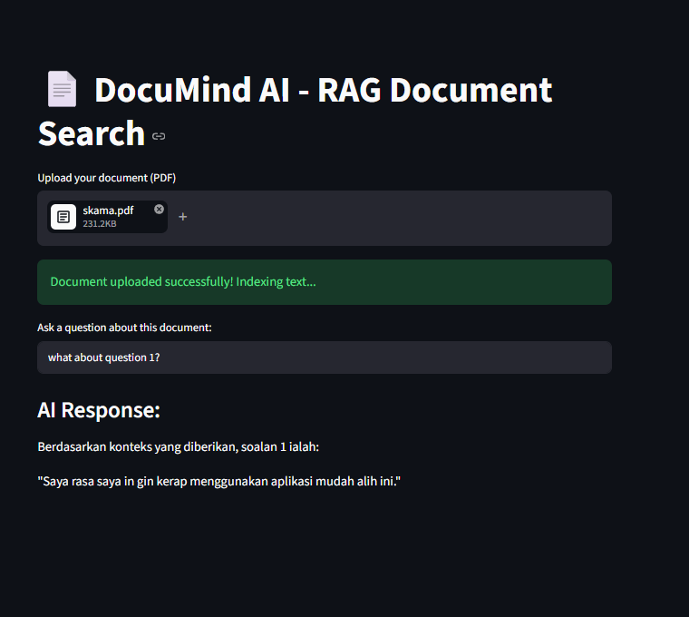
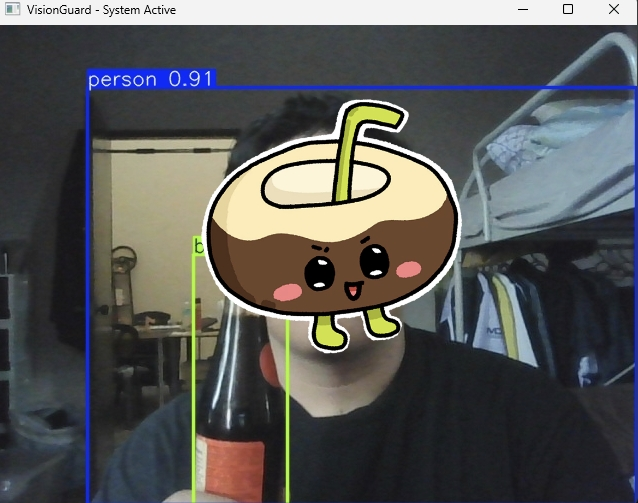
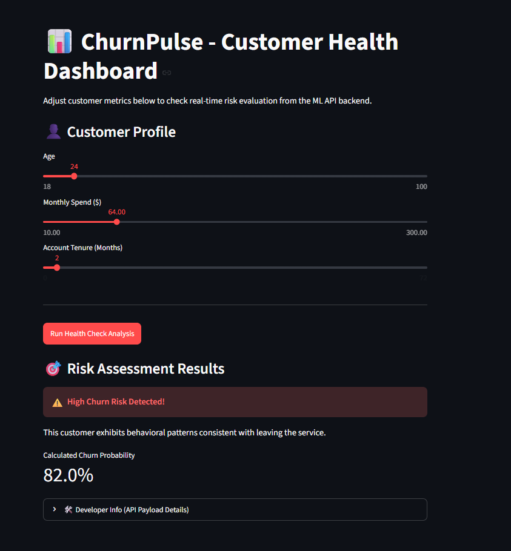
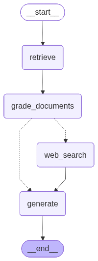

# 🚀 My AI & Machine Learning Projects

Welcome to my AI portfolio! This repository contains four distinct projects that demonstrate different areas of Artificial Intelligence, ranging from simple document search apps to full-stack machine learning models and advanced autonomous AI agents.

---

## 📄 Project 1: DocuMind AI (Document Chatbot)

### What it is
DocuMind AI is a smart document reader that allows users to upload a PDF file and ask questions about its content in plain language. Instead of scrolling through hundreds of pages, the AI finds the exact sections relevant to your question and uses Google's Gemini model to give you a precise answer based only on that document.

### 📸 Project Demo

### How it works (RAG Workflow)
* **Upload:** The student or user uploads a PDF file through a friendly web interface built with Streamlit.
* **Chunking & Storage:** The app reads the PDF, breaks the text into smaller pieces, converts them into mathematical vectors using Hugging Face embeddings, and stores them in a local database called ChromaDB.
* **Search & Answer:** When you ask a question, the app searches ChromaDB for the closest matching text blocks, sends those blocks to Gemini 1.5 Flash, and displays the clean answer on the screen.

### Tech Stack
* **Frontend UI:** Streamlit
* **AI Core:** Google GenAI (Gemini-1.5-flash)
* **Database & Processing:** ChromaDB, LangChain, PyTorch

---

## 👁️ Project 2: VisionGuard (Object Detection App)

### What it is
VisionGuard is a real-time computer vision application designed to detect and identify objects through a live camera stream or a pre-recorded video. It acts like an automated security guard or monitor, recognizing items instantly as they appear in the frame.

### 📸 Project Demo

### How it works
* **Video Feed:** The app captures live frames from a laptop webcam or video file using the OpenCV library.
* **AI Processing:** Each frame is sent to a pre-trained YOLOv8 (You Only Look Once) deep learning model, which is highly famous for being extremely fast at processing visuals.
* **Visual Feedback:** The app draws bounding boxes around detected objects (like people, laptops, or backpacks) and labels them with a confidence percentage score in real-time.

### Tech Stack
* **Core Framework:** Python, OpenCV (cv2)
* **Computer Vision Model:** Ultralytics YOLOv8
* **Deep Learning Backend:** PyTorch

---

## 📉 Project 3: ChurnPulse (Predictive API & Dashboard)

### What it is
ChurnPulse is a complete full-stack Machine Learning project built to predict whether a customer is going to stop using a service (called "churning") based on metrics like their age, monthly spending, and how many months they have been a subscriber.

### 📸 Project Demo

### How it works
* **The Model:** A Random Forest Classifier machine learning model is trained on historical customer data to find patterns (for example, young customers with high spend but short tenure are high-risk).
* **The Backend API:** The trained model is saved and hosted inside a fast web framework called FastAPI. It sits in the background waiting for data.
* **The User Interface:** A Streamlit dashboard provides easy sliders for Age, Monthly Spend, and Tenure. When you click "Run Health Check", the dashboard sends a quick JSON request behind the scenes to the FastAPI server, runs the model, and displays a nice color-coded alert card ("High Risk" or "Stable Customer").

### Tech Stack
* **Machine Learning:** Scikit-Learn, Pandas, Joblib
* **Backend Microservice:** FastAPI, Uvicorn, Pydantic
* **Frontend UI:** Streamlit

---

## 🤖 Project 4: Autonomous-Agent-Graph (Self-Correcting AI)

### What it is
This is the most advanced project in the portfolio. Instead of just sending a question straight to an AI and hoping for a good answer, this system builds a team of mini-AI agents that talk to each other, grade each other's work, and autonomously look things up on the internet if their local knowledge isn't good enough.

### 📸 Project Demo & Architecture

### How it works (The State Graph)
* **Retrieve Node:** The system first searches a local text database for an answer to your question.
* **Grading Node:** A reviewer agent evaluates the found data and answers with a strict "YES" or "NO" on whether the information is actually relevant.
* **Web Search Fallback Node:** If the grader says "NO" (meaning the database doesn't know the answer), the system automatically triggers a web agent to go search the live internet via DuckDuckGo.
* **Generate Node:** Once valid facts are secured, a final synthesis agent combines everything into an expert response.
* **Architecture Diagram:** The app automatically generates a flowchart mapping file (`agent_architecture.png`) showing how the decision logic loops back and self-corrects.

### Tech Stack
* **Agentic Framework:** LangGraph
* **Orchestration:** LangChain Core
* **Large Language Model:** Google Gemini (via langchain-google-genai)
* **Search Integration:** DuckDuckGo Search API
